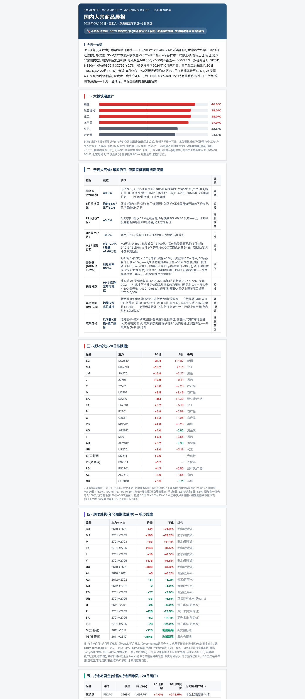
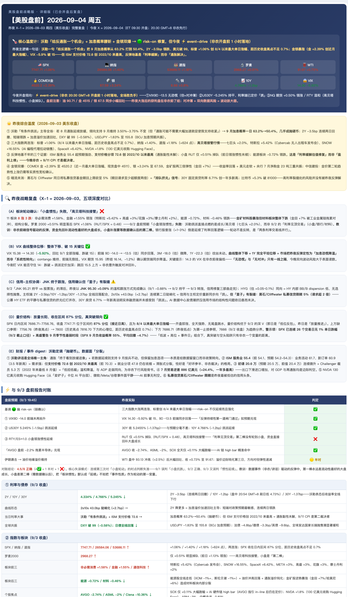
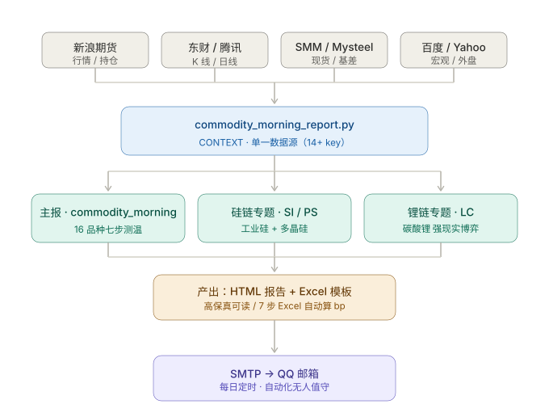

# 🚀 把期货经纪的日常，做成可复用的开源自动化

> 两个在 WorkBuddy 上每天无人值守运行的实战项目——**大宗商品晨报 + 美股日报**——从一段真实期货经纪业务里沉淀而来，现已开源。

[](../LICENSE)
[](../actions/workflows/ci.yml)

---

## 为什么做这套东西

做期货经纪的人都知道这个痛点：**分析报告大多是"自嗨"。** 一份报告写完了，客户看一眼标题就划走——因为里面全是"市场上涨 0.5%、结构分化、中性偏多"这种正确的废话，客户看完还是不知道**该做什么**。

我在 2026 年 8 月给自己定下一条标准，把报告从"分析师自嗨"改成"客户能直接行动"：

> **报告不是给自己看的，是给客户群用的——每一份必须让读者能脱口回答"那我现在怎么办"。**

这套 `hongshuhai-market-briefings` 就是在这个标准下，迭代了一个月、稳定下来后决定开源的两个日常自动化项目。

## 三个与众不同的点

### 1. 客户级 Actionable（L1 → L2 → L3 三层升级）

一般研报停留在 **L1 分析层**（"价差走扩，355 元"）。我们强制升级：

| 层级 | 回答的问题 | 示例 |
|---|---|---|
| **L1 分析层** | 说了什么 | 工业硅 SI2611 价差走扩 355 元 |
| **L2 咨询层** | 为什么，客户怎么反问你 | "为什么弱？"——三句话拆解 + 口径备注 |
| **L3 行动层** | **现在怎么办** | 上游卖套保 / 中游反套 / 下游买套保，每个点位 + 量化参数 |

L3 不是"建议加套保到 50%+"这种模糊话，而是给到**精确触发条件**：

- 头寸变动要可执行：释放套保 → "从 X% 降至 Y%"，附现货端动作、附重建条件
- 场景拆开：一个动作对应两个相反触发场景时，拆成两条分别写
- 时间周期标注：净利测算前注明持有周期（60-90 天）
- 验证信号给**边界值**：不写模糊的"收敛/走扩"，给 -3000 / -4000 / -4500 三档数值触发器
- 末尾加**⚠ 切忌**警示框，对冲"按建议操作却忽略前提"的风险

### 2. 单源架构（改一处，同步三处）

大宗商品模块的工业硅 / 多晶硅 / 碳酸锂专题很容易各自为政。我们用**单一 `CONTEXT` 数据源**把三份报告锁在一起：

```
commodity_morning_report.py  ← CONTEXT（14+ key，唯一数据源）
        ↓ from . import CONTEXT
silicon_focus_report.py      ← 工业硅 SI / 多晶硅 PS 专题
lithium_focus_report.py      ← 碳酸锂 LC 第二主战场专题
```

改一个价表 / 基本面，三份报告自动同步。这是它能长期维护而不腐烂的关键。

### 3. 零硬编码凭证（安全基线）

开源最大的雷是泄露密钥。这套项目从设计上避免：

- QQ 邮箱授权码**统一从 macOS Keychain 取**（`security find-generic-password -s QQMailAuthCode -w`），代码里零明文
- 仓库自带 `.github/workflows/ci.yml`，每次 push 都会**扫描硬编码凭证**（密码/Token/授权码明文），守住安全基线

## 演示一：大宗商品晨报（07:30 自动发送）

七步测温框架覆盖 16 个品种板块轮动 + 期限结构 + 基差，再叠加硅链/锂链两大主战场专题：



## 演示二：美股日报（19:45 自动发送）

盘前战略版 = 昨夜完整复盘 + 今夜开盘开关，用 3 个触发器（VIX9D / US30Y / RTY-vs-SPX）判定当日方向，7 步扫描 Excel 模板自动算 bp：



## 数据流图：单源架构



## 如何开始

### 前置要求

- macOS（SMTP 走 Keychain 取授权码，Linux 需自行接 env）
- Python 3.10+（纯标准库，无需 pip install 打底）

### 拉取

```bash
git clone https://github.com/hongshuhai/hongshuhai-market-briefings.git
cd hongshuhai-market-briefings
```

### 跑一份晨报

```bash
cd commodity/scripts
python3 commodity_morning_report.py          # 生成 HTML 报告
python3 send_report.py                        # 发送到 QQ 邮箱
```

### 配置授权码（仅 macOS）

```bash
security add-generic-password -s QQMailAuthCode -a hongshuhai@foxmail.com -w '<你的授权码>'
```

### 挂到 WorkBuddy 自动化

把 `SKILL.md` 和 `scripts/` 复制到 `~/.workbuddy/skills/<name>/`，在 WorkBuddy 里配上每日定时任务，就可无人值守运行。

## 技术栈

| 层 | 技术 |
|---|---|
| 数据源 | 新浪期货 / 东财 / 腾讯行情 / SMM / Mysteel / Yahoo |
| 语言 | Python 3.10+（纯标准库，Excel 需 `openpyxl`） |
| 报告 | HTML 邮件模板 + 7 步扫描 Excel 模板 |
| 发送 | SMTP（QQ 邮箱，授权码走 macOS Keychain） |
| 自动化 | WorkBuddy Automation（每日定时触发） |
| CI | GitHub Actions（语法校验 + 凭证扫描） |

## 项目结构

```
hongshuhai-market-briefings/
├── README.md / LICENSE / .gitignore
├── docs/                    # 5 篇深度文档 + 项目介绍
├── commodity/               # 大宗商品晨报（含硅链/锂链专题）
│   ├── SKILL.md
│   ├── scripts/             # 主报 + 硅链 + 锂链，12 个脚本
│   └── examples/            # 3 个真实示例 HTML
├── us-stock/                # 美股日报
│   ├── SKILL.md
│   ├── scripts/             # 6 个脚本
│   ├── templates/           # 7 步扫描 Excel 模板
│   └── examples/            # 1 个真实示例 HTML
└── assets/                  # 截图 + 数据流图
```

## 维护与许可

- **MIT License**：允许商用、修改、闭源衍生，保留版权声明即可
- 已用 GitHub Actions 做语法校验 + 凭证扫描，日常维护零负担
- 欢迎提 Issue / PR，一起把工作流打磨得更好

---

*项目作者：洪树海（Frank）—— 期货经纪 / 波动率实验室。选定单一积累路径，深度优先于广度。*

> ⚠️ **免责声明**：本项目的所有报告内容仅供参考与学习，不构成投资建议。期货交易风险极高，请独立判断并自负盈亏。
